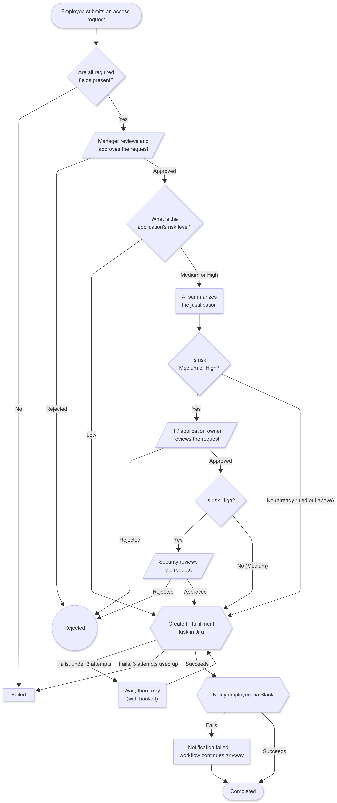

# Meridian Flow

Enterprise Employee Workflow Automation Platform — a reusable workflow orchestration system that automates internal employee processes (onboarding, software access requests) through configurable workflows, human approval chains, business rules, AI-assisted recommendations, and MCP-powered integrations, with complete auditability.

**Status:** Version 1 in active development. This README documents what's built so far (Phase 12 of the build) — not a finished product. See [docs/decisions/](docs/decisions/) for the reasoning behind every major architecture choice, and [docs/architecture/](docs/architecture/) for how the system fits together.

## Workflow diagrams

Both V1 workflows, generated directly from the workflow JSON definitions and the execution engine — not hand-drawn, so they can't drift out of sync with the code. Editable Mermaid source is in [docs/workflows/flow-diagrams.md](docs/workflows/flow-diagrams.md).

**Employee Onboarding**


**Software Access Request**



## What's here right now

- FastAPI backend skeleton with structured config, logging, and `/health` + `/health/ready` endpoints
- Local JWT auth: login, `/auth/me`, six roles (employee, manager, hr, it, security, administrator), server-side role enforcement (`/users` is administrator-only)
- Employee directory: `Employee` + `Department` models (self-referential manager relationship), `/employees` and `/departments` APIs (read for any authenticated user, write restricted to HR/Administrator), a React table view in the dashboard
- Workflow definitions and state model: `WorkflowDefinition` / `WorkflowInstance` / `WorkflowStepInstance` / `WorkflowEvent` models, a validated JSON schema for workflow definitions, the two V1 workflow templates (`workflows/employee_onboarding.json`, `workflows/software_access_request.json`), and an enforced state machine for both instance and step transitions
- **Workflow execution engine** (Phase 6): `start_workflow` / `advance_workflow` / `resume_workflow_step` actually run a workflow — executing steps in definition order, evaluating `condition` strings with a safe (non-`eval`) expression parser, dispatching to stub `ai_action`/`mcp_tool` executors that stand in for the not-yet-built AI service and MCP server, applying each step's configured retry/fail/continue behavior, and pausing for human approval. A real polling worker (`app/workers/runner.py`, its own Compose service) picks up retry-scheduled steps once their backoff elapses. `docker compose up` now auto-starts one real onboarding instance for the demo new hire, paused at the manager-approval step
- **Approval engine** (Phase 7): `ApprovalRequest` / `ApprovalDecision` models, created the moment a workflow step pauses. Assignment resolves two ways — `manager_approval` goes to the new hire's actual manager (via `Employee.manager_id` → their linked `User`, if they have a login), while IT/Security approvals go to a role-based pool (anyone with that role can pick it up). A real inbox: `GET /approvals` returns exactly what's relevant to the caller (assigned-to-them, their role's pool, or everything for Administrators), `POST /approvals/{id}/decide` records the decision and resumes (or ends) the underlying workflow instance. Live in the dashboard as the "Pending Approvals" section, above the employee directory
- **Business rules engine + second workflow** (Phase 8): `Application` catalog (seeded, spans all three risk levels — see ADR-0009 for why it's an internal table, not an Okta integration), `services/rules/service.py`'s `classify_request_risk`/`should_auto_approve` (pure functions, no DB, no I/O), and `POST /access-requests` — the software-access-request workflow's real entry point. A low-risk request auto-approves and runs straight to completion with zero human involvement; anything else pauses at `manager_approval` exactly like onboarding does, proving the same engine, state machine, and approval infrastructure genuinely support a second, different business process. `GET /applications` lists the catalog. `docker compose up` now also seeds a second demo instance (Jordan Lee requesting AWS Console — low-risk employee, high-risk app, still classified high-risk) showing the full manager+IT+security chain
- **AI service** (Phase 9): `services/ai/service.py` replaces the Phase 6 stub with real OpenAI calls (structured outputs, never hand-parsed free text) for the two `ai_action` steps that exist — `recommend_access_package` (onboarding) and `summarize_justification` (access requests). The access-package recommendation is structurally constrained to the current `AccessPackage` catalog via a dynamically-built Pydantic enum, so the model can't invent a package that doesn't exist — it can only pick from what's actually seeded. Every call, success or failure, writes an `AIExecution` audit row. No API key configured (or any other failure — timeout, bad response) degrades gracefully: the step fails through the same retry/fail/continue machinery every other step uses, and a safe default (`requires_human_review: true`) still reaches the downstream review gate instead of silently skipping it. See ADR-0011 for why this doesn't go through MCP yet (that's Phase 10)
- **MCP server + agentic AI tool calls + Jira fulfillment (Phase 10)**: a real MCP server (`mcp_server/`, FastMCP) exposing `create_jira_task`, `send_slack_notification`, `schedule_calendar_event`, and `lookup_employee` as typed, validated tools (mock mode by default — no real Jira/Slack/Google credentials needed to run the demo). `services/integrations/mcp_client.py` is the one place backend/ calls MCP from, writing an `MCPToolExecution` audit row on every call, success or failure. `services/ai/service.py`'s `recommend_access_package` now runs a real agentic tool-calling loop — the model can call `lookup_employee` itself before answering, not just receive employee data pre-stuffed into its prompt. `create_it_tasks`/`create_fulfillment_task` steps now pause (`waiting_external`) until a real, HMAC-SHA256-signature-verified `POST /webhooks/jira` delivery confirms the created issue reached Done (see [ADR-0010](docs/decisions/0010-jira-fulfillment-confirmation-via-webhook.md)) — proving the platform reacts to external system events, not just human decisions
- **Notification system (Phase 11)**: `Notification` model + `services/notifications/service.py`'s `notify()`, called from the three points a workflow event matters to a specific person — a specifically-assigned approver gets pinged in-app + Slack the moment their approval opens, a submitter gets an in-app notice when their request completes, and an in-app + simulated-email notice if it's rejected (with the rejection reason). One-time notify only in V1, no SLA timers or resend — see the module docstring for why. `GET /notifications` (mine, in-app only) and `POST /notifications/{id}/read` round it out
- **Admin dashboard (Phase 12)**: a read-only `services/dashboard/service.py`, all routes Administrator-only. `GET /dashboard/summary` powers an Overview page (active/pending/failed/completed counts, average completion time, requests by type/department). `GET /workflow-instances` (+ `?status=`, + `/{id}`) powers a filterable Workflow Instances list, a Failed Workflows view (same endpoint, `?status=failed`), and a Workflow Detail page showing every step, approval chain (with nested decisions), AI execution, MCP tool call, and notification tied to one instance. `GET /audit-log` composes `WorkflowEvent`/`ApprovalRequest`/`AIExecution`/`MCPToolExecution`/`Notification` rows into one chronological feed at read time — no dedicated `AuditLog` table, see `docs/architecture/data-model.md`'s cuts for why. No new migrations this phase; it's a pure query layer over tables every earlier phase already writes
- React + TypeScript + Vite + Tailwind CSS frontend with a working login flow, an approval inbox, an employee directory table, and (Administrator-only) Overview / Workflows / Failed Workflows / Workflow Detail / Audit Log dashboard pages
- Postgres via Docker Compose, with Alembic migrations (`users`, then `departments` + `employees`, then `workflow_definitions` / `workflow_instances` / `workflow_step_instances`, then `workflow_events`, then `approval_requests` / `approval_decisions`, then `applications`, then `access_packages`, then `ai_executions`, then `mcp_tool_executions`, then `workflow_step_instances.external_ref`, then `notifications`)
- Nine demo employees / six demo user logins / seven demo applications / eight demo access packages auto-seeded on `docker compose up`, at a fictional company (Cordant Industries) — see `backend/app/db/seed.py`
- Linting (Ruff + MyPy for backend, ESLint for frontend) and a pytest suite covering auth, the employee directory, the workflow state machine, the workflow definition loader/schema, the condition evaluator (including explicit "malicious expression" safety tests), the execution engine (happy path, rejection, retry-and-recover, retries-exhausted, idempotency, worker polling), the approval engine (approver resolution, inbox filtering by role/assignment, approve/reject, authorization, already-decided conflicts), the rules engine (the full risk-classification matrix), the access-request flow (auto-approve, high-risk pause, missing-employee-link, unknown-application, full HTTP round trip), the AI service (confidence-based review routing, graceful fallback on missing key/no catalog/model refusal, the dynamic catalog constraint), the Jira fulfillment webhook (signature verification, idempotency, unknown/non-Done deliveries), the notification system (in-app/Slack/email writes, Slack-failure resilience, no-recipient no-op, engine wiring at all three trigger points), and the dashboard/audit endpoints (summary counts and breakdowns, instance list filtering including the failed-only case, instance detail composition, and the composed audit timeline both globally and per-instance) — all against mocked OpenAI and MCP clients, no real API keys needed to run the suite
- GitHub Actions CI running migrations + lint + tests on every push

## Demo users

All seeded with the password from `DEMO_PASSWORD` in `backend/app/db/seed.py` (`MeridianDemo123!` by default — a local-dev-only credential, change it in your own `.env`-driven seed if you ever expose this anywhere real).

| Email | Role |
|---|---|
| priya.anand@cordant.io | HR |
| daniel.osei@cordant.io | Manager |
| sam.whitfield@cordant.io | IT |
| renee.castillo@cordant.io | Security |
| jordan.lee@cordant.io | Employee |
| ava.thompson@cordant.io | Administrator |

## Running locally (Docker Compose — recommended)

```bash
cp .env.example .env
# edit .env if you want, defaults work for local dev
docker compose up --build
```

- Backend: http://localhost:8000 (docs at http://localhost:8000/docs)
- Frontend: http://localhost:5173
- Postgres: localhost:5433 (mapped off the default 5432 to avoid colliding with any other Postgres already running on your machine — see the comment in `docker-compose.yml`) (user/pass/db: `meridian`/`meridian`/`meridian_flow`)

The backend container runs migrations and seeds demo users automatically on startup (`alembic upgrade head && python -m app.db.seed`) before starting the API — that's why login works immediately after `docker compose up`, no manual setup step needed.

## Running the backend without Docker

```powershell
cd backend
python -m venv .venv
.venv\Scripts\activate
pip install -r requirements-dev.txt

# Settings reads backend\.env (not the repo-root one Docker Compose uses) —
# create it if it doesn't exist yet:
Copy-Item ..\.env.example .env

# Requires a Postgres reachable at DATABASE_URL. If you're running Postgres
# via `docker compose up` (recommended — see above), that's exposed on host
# port 5433, not 5432, specifically to avoid colliding with any other
# Postgres already on your machine. Point backend\.env at it:
(Get-Content .env) -replace '@db:5432/', '@localhost:5433/' | Set-Content .env

alembic upgrade head
python -m app.db.seed
uvicorn app.main:app --reload
```

## Running the frontend without Docker

```powershell
cd frontend
npm install
npm run dev
```

## Testing and linting

```powershell
# backend — requires migrations applied against a reachable Postgres (see above)
cd backend
pytest
ruff check .
mypy app

# frontend
cd frontend
npm run lint
npm run build
```

## Project structure

```
backend/        FastAPI app (routes, services, repositories, models — see docs/architecture/service-boundaries.md)
mcp_server/      MCP server exposing Jira/Slack/Calendar/employee-lookup tools (Phase 10)
frontend/        React + TypeScript + Vite + Tailwind dashboard
workflows/       Versioned JSON workflow definitions (employee_onboarding, software_access_request)
diagrams/        Exported PNGs of the workflow flow diagrams (source: docs/workflows/flow-diagrams.md)
docs/
  architecture/  System design docs — read these first
  decisions/     ADRs — the "why" behind every major choice
  workflows/     Workflow flow diagrams (Mermaid source + generation prompt)
docker-compose.yml
.env.example
```

## Companion project

This is the second of two portfolio projects demonstrating enterprise automation engineering. The first, [AI IT Ticket Automation Platform](#), automates a single IT ticket workflow end-to-end (Jira, Slack, rule engine, AI fallback). This project proves the *reusability* of a workflow engine across multiple business processes (onboarding, access requests) and adds MCP-based AI agent tool-calling, which the first project doesn't have.
