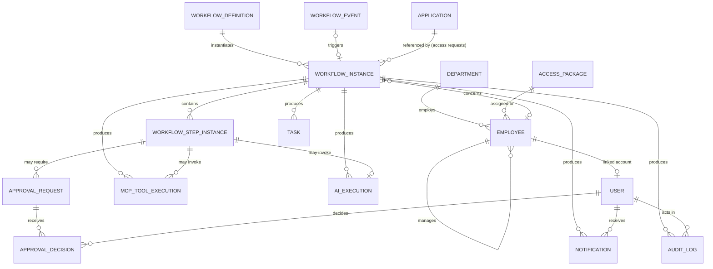

# Data Model

Cut from the spec's suggested 19 tables to 16. Every cut and every addition is justified below — don't skip this section when reviewing, since the reasoning is the actual deliverable here, not just the table list.

## Cuts from the original list

- **Role** — not a table. Role is an enum on `User` (`employee`, `manager`, `hr`, `it`, `security`, `administrator`). No dynamic role management in V1, so a table buys nothing.
- **WorkflowStepDefinition** — not a table. Step definitions live inside `WorkflowDefinition.definition_json`. We're explicitly not building a relational drag-and-drop workflow designer, so there's no reason to normalize steps into rows.
- **BusinessRule** — not a table. Rules are versioned Python functions/config in `services/rules`, covered by unit tests. A DB-editable rules table implies a rules-admin UI we're not building; storing them as code is simpler, more testable, and still demonstrates "rules separated from routing."
- **IntegrationExecution** — merged into `MCPToolExecution`. Every external integration in this project (Jira, Slack, Calendar) is invoked *through* MCP — there's no integration that bypasses it — so a separate generic "integration" audit table would just duplicate `MCPToolExecution` row-for-row.
- **IdempotencyKey** — merged into `WorkflowEvent.dedup_key` (unique constraint). The event that seeds a workflow instance *is* the idempotency boundary; a separate table for the same concept adds a join for no new capability.

## Addition beyond the original list

- **AccessPackage** — a small seeded catalog (5-8 rows: e.g. "Engineering – Standard", "Finance – Standard", "IT – Elevated"). The AI recommends *one of these*, not free-text — this is what keeps the "rules before AI" principle honest for the onboarding flow: AI narrows a catalog, it doesn't invent an access grant from scratch.
- **Application** — a small seeded catalog of systems employees can request access to (e.g. Salesforce, Confluence, AWS Console), each with a `risk_level`. This is what makes the access-request workflow's risk classification a deterministic rules-engine lookup instead of an AI guess.

## Entity relationship diagram

## Tables

**User** — `id, email, hashed_password, full_name, role, is_active, created_at, updated_at`. Auth identity, built in Phase 3. `employee_id` (FK, nullable) is added in a Phase 4 migration once the `Employee` table exists — Phase 3 deliberately doesn't forward-declare a FK to a table that doesn't exist yet. Once added, it'll link a login to a directory record (an Employee doesn't need a User account to be onboarded — HR creates the Employee row before the person ever logs in). `full_name` was added during Phase 3 build-out — not in the original Phase 1 sketch, but needed the moment there's a UI showing "signed in as ___."

**Department** — `id, name`. *(Built in Phase 4.)*

**Employee** — `id, first_name, last_name, work_email, personal_email (nullable), job_title, department_id (FK), manager_id (FK, self-referential, nullable), employment_type, start_date, status, location, risk_level, created_at, updated_at`. *(Built in Phase 4.)* `access_package_id` is listed in the ERD above but deliberately **not** a real column yet — `AccessPackage` doesn't exist until Phase 9, and Phase 3 already established the pattern of not forward-declaring a FK to a table that doesn't exist (`User.employee_id` waited for `Employee` the same way). It'll be added in the Phase 9 migration alongside the table itself.

**AccessPackage** — `id, name, department_id (FK, nullable), risk_level, included_systems (JSON), description, created_at`. Seeded reference data.

**Application** — `id, name, description, risk_level, created_at`. *(Built in Phase 8.)* Seeded reference data (7 rows spanning all three risk levels — see `backend/app/db/seed.py`), drives access-request risk classification (`services/rules/service.py::classify_request_risk`). Revised from the Phase 1 sketch above (which also listed `owner_role`): nothing in the Phase 8 implementation reads it — `it_approval` and `security_approval` steps route to fixed roles (`it`, `security`) regardless of which application is being requested, not to a per-application owner. Per-application dynamic approver routing is a real feature, not something this project has built; shipping the column anyway would just be dead weight. See ADR-0009 for the related decision not to source this catalog from a real identity provider (Okta) in V1.

**WorkflowDefinition** — `id, key, name, version, trigger_type, trigger_event, definition_json, is_active, created_at`. *(Built in Phase 5.)* `employee_onboarding` and `software_access_request` each get one row (loaded from `workflows/*.json` at seed time by `services/workflows/definition_loader.py`, validated against `WorkflowDefinitionSchema`). `key` is not unique alone — `(key, version)` identifies a specific revision; only one row per `key` should be `is_active=True`, enforced by the loader.

**WorkflowEvent** — `id, event_type, payload (JSON), dedup_key (unique), received_at, workflow_instance_id (FK, nullable)`. *(Built in Phase 6.)* The idempotency boundary: `dedup_key` (e.g. `employee_onboarding:{employee_id}`) has a unique constraint, so the same trigger arriving twice can never spawn two instances — `start_workflow` checks for an existing row by `dedup_key` first and returns the already-running instance instead.

**WorkflowInstance** — `id, workflow_definition_id (FK), status, input_data (JSON), initiated_by_user_id (FK, nullable), employee_id (FK, nullable), current_step_key, started_at, updated_at, completed_at`. *(Built in Phase 5; populated for real starting Phase 6.)* One row per running/completed onboarding or access request. See [workflow-state-model.md](./workflow-state-model.md) for `status` values and the enforced transition table (`services/workflows/state_machine.py`).

**WorkflowStepInstance** — `id, workflow_instance_id (FK), step_key, step_type, status, input_data, output_data, attempt_count, scheduled_at, started_at, completed_at, error_message, created_at`. *(Built in Phase 5; populated for real starting Phase 6.)* One row per step per instance, in execution order.

**ApprovalRequest** — `id, workflow_instance_id (FK), step_instance_id (FK), approver_role, assigned_user_id (FK, nullable), status, sequence_order, due_at (nullable), created_at`. *(Built in Phase 7.)* `sequence_order` is display-only in V1 (e.g. "step 2 of 3") — the actual sequencing is already enforced by the engine only ever pausing on one approval step at a time, so this column doesn't do any gatekeeping itself. `assigned_user_id` is set for `manager_approval` (resolved to the specific employee's actual manager, not any user with role=manager) and left null for IT/Security approvals, which are a role-based pool instead — see `services/workflows/service.py::_resolve_approver`.

**ApprovalDecision** — `id, approval_request_id (FK), decided_by_user_id (FK), decision, notes, decided_at`. *(Built in Phase 7.)* Reuses the same `approval_request_status` enum as `ApprovalRequest.status` for the `decision` column (never stores `pending`) — one Postgres enum type, not two, since the values are identical.

**Task** — `id, workflow_instance_id (FK), step_instance_id (FK, nullable), task_type, assigned_role, status, description, created_at, completed_at`. Internal checklist items (e.g. "IT: provision laptop") that aren't necessarily backed by an external MCP call.

**MCPToolExecution** — `id, tool_name, caller (workflow_engine | ai_agent), workflow_instance_id (FK, nullable), step_instance_id (FK, nullable), input_params, output_result, status, attempt_number, duration_ms, error_message, created_at`. The single audit table for every Jira/Slack/Calendar/employee-lookup call, from either caller.

**AIExecution** — `id, workflow_instance_id (FK), step_instance_id (FK), task_type, input_summary, output_json, confidence_score, requires_human_review, model_used, tokens_used, status, error_message, created_at`.

**Notification** — `id, user_id (FK), workflow_instance_id (FK, nullable), type, title, body, channel (in_app | slack), status, created_at, read_at (nullable)`.

**AuditLog** — `id, timestamp, actor_user_id (FK, nullable), actor_type (user | system | ai), action, resource_type, resource_id, workflow_instance_id (FK, nullable), outcome, metadata (JSON)`. `actor_user_id` is null for system/AI-originated events; `actor_type` disambiguates.

## What's NOT logged in metadata / what gets redacted

`AuditLog.metadata` and `MCPToolExecution.input_params`/`output_result` must never contain: `personal_email`, `hashed_password`, raw JWTs, or API keys/tokens for Jira/Slack/Google/OpenAI. Redaction happens at the point of writing the row (a helper in `services/audit` strips known-sensitive keys before persisting), not as an afterthought at read time.
