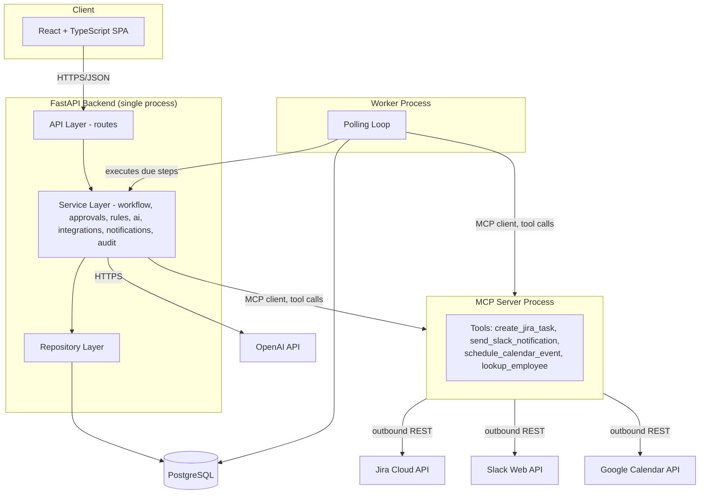

# System Architecture — Meridian Flow

## What this is

Meridian Flow is a modular monolith: one FastAPI backend, one Postgres database, one background worker process, one MCP server process, and a React frontend. Five processes total, all run locally through Docker Compose. No hosting, no message broker, no microservices in V1.

## Why this shape

The project has to demonstrate *enterprise-realistic* patterns (workflow orchestration, approvals, retries, audit, AI-assisted decisions, MCP tool-calling) at *portfolio* scale (a handful of demo workflows, not production traffic). A microservices split or a Celery/Redis job queue would add real operational surface area — service discovery, network failure modes, a second datastore — without adding anything an interviewer can see in a 5-minute demo. Every extra moving part has to earn its place; none of these do yet. See [ADR-0001](../decisions/0001-modular-monolith.md) and [ADR-0002](../decisions/0002-db-backed-workflow-engine.md).

## Diagram



## Components

**Frontend (React + TypeScript + Vite).** Talks only to the FastAPI backend's REST API. Never calls MCP, OpenAI, Jira, Slack, or Calendar directly. This keeps all business rules, auth checks, and audit logging server-side, where they're enforceable.

**Backend (FastAPI).** Layered: routes are thin (parse request, call a service, return response — no business logic), services hold the actual workflow/approval/rules/AI/audit logic, repositories are the only layer that touches SQLAlchemy/the DB directly. See [service-boundaries.md](./service-boundaries.md).

**Worker.** A separate process (`python -m app.workers.runner`), same codebase and DB as the API, polling for `WorkflowStepInstance` rows that are due to run or due to retry. Runs the same service-layer code the API would call synchronously — it's a scheduler, not a parallel implementation. See [background-jobs.md](./background-jobs.md).

**MCP server.** A standalone process exposing four typed tools over MCP. Both the backend's workflow engine (deterministic calls, e.g. "create this Jira task now") and the AI service (agentic calls, e.g. the LLM deciding to look up an employee's manager before recommending access) act as MCP clients against it. See [mcp-architecture.md](./mcp-architecture.md).

**Postgres.** Single database. Also the job queue (workflow steps due to run) and the idempotency boundary (unique constraints, not a message broker's dedup logic).

## Adopted repository structure

Deviates from the originally sketched structure in one meaningful way: MCP lives at the top level as its own service (`mcp_server/`), not nested inside `backend/app/mcp/`. Reason: it has to run as a real, separate MCP server process for the tool-calling story to be genuine — if it's just a Python module the backend imports and calls as functions, there's no protocol boundary and nothing to actually demo as "MCP."

```
enterprise-ai-workflow-automation-platform/
├── backend/
│   ├── app/
│   │   ├── api/
│   │   │   ├── routes/
│   │   │   └── deps.py            # auth + role-check dependencies
│   │   ├── core/                  # config, security, logging setup
│   │   ├── db/                    # session, declarative base
│   │   ├── models/                # SQLAlchemy models
│   │   ├── schemas/                # Pydantic I/O + AI structured-output schemas
│   │   ├── services/
│   │   │   ├── workflow/           # engine: start/execute/pause/resume/fail
│   │   │   ├── approvals/
│   │   │   ├── rules/               # code-based rules engine
│   │   │   ├── ai/                   # AI service, prompt building, output validation
│   │   │   ├── integrations/         # MCP client wrapper, retry, audit
│   │   │   ├── notifications/
│   │   │   └── audit/
│   │   ├── repositories/            # one per aggregate (employee, workflow, approval...)
│   │   ├── workers/                  # polling worker entrypoint
│   │   └── tests/
│   ├── alembic/
│   └── Dockerfile
├── mcp_server/
│   ├── server.py                     # tool registration, MCP transport
│   ├── tools/
│   │   ├── jira_tool.py
│   │   ├── slack_tool.py
│   │   ├── calendar_tool.py
│   │   └── employee_lookup_tool.py
│   ├── mock/                          # canned responses for MOCK_MODE
│   └── Dockerfile
├── frontend/
│   ├── src/
│   │   ├── api/
│   │   ├── components/
│   │   ├── features/{employees,workflows,approvals,audit}/
│   │   ├── hooks/
│   │   ├── pages/
│   │   └── types/
│   └── Dockerfile
├── workflows/
│   ├── employee_onboarding.json
│   └── software_access_request.json
├── docs/{architecture,decisions,workflows,api,testing}/
├── diagrams/
├── demo/
├── docker-compose.yml
├── .env.example
├── .gitignore
├── LICENSE
└── README.md
```

## Build status

Backend, frontend, employee directory, and the workflow definition/state-model data layer are built (Phases 2-5). The worker process is real as of Phase 6 — `app/workers/runner.py`, its own Compose service. The MCP server process (`mcp_server/`) is not built yet (Phase 10); until then, `ai_action`/`mcp_tool` steps run through stub executors in `app/services/workflows/executors.py` rather than the real OpenAI/MCP calls this diagram shows.

## What's explicitly deferred

No hosting/deployment (see [ADR-0007](../decisions/0007-no-hosting-in-v1.md)). No Redis/Celery/Temporal. No microservice split of workflow/approval/rules — they're separate service modules in one process, not separate deployables. Revisit only if a real scale or team-ownership reason shows up.
