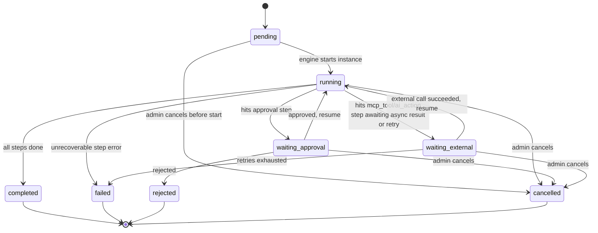
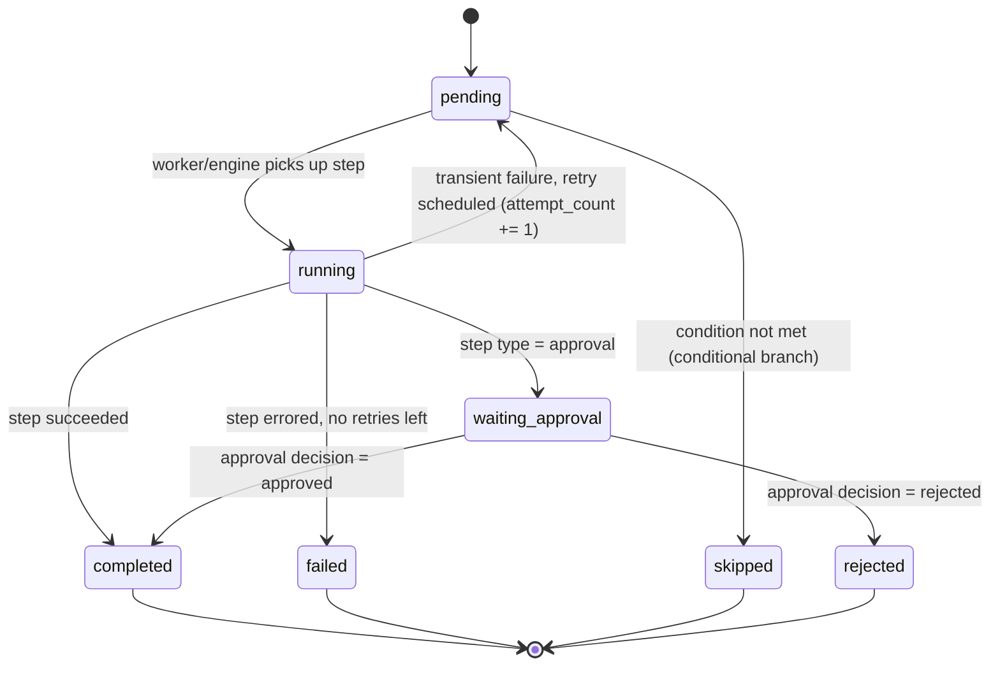

# Workflow State Model

## Is a state machine pattern appropriate here? Yes.

Workflow status changes are the single most correctness-sensitive part of this system — a bad transition (e.g. resuming a rejected workflow, or completing a workflow with a pending approval) is a data-integrity bug, not a cosmetic one. An explicit, table-driven state machine — a `Dict[Status, Set[Status]]` of allowed transitions checked before every status write — is cheap to implement, trivially unit-testable (one test per transition, one test per rejected invalid transition), and self-documenting. The alternative (status checks scattered across `if/elif` in service methods) is exactly what the spec's "avoid premature abstractions, avoid giant service classes" guidance is warning about *not* doing carelessly — but a state machine here isn't premature abstraction, it's the minimum structure that makes the correctness property testable at all.

## WorkflowInstance states

`pending, running, waiting_approval, waiting_external, completed, failed, rejected, cancelled`

Dropped `draft` from the spec's suggested list — HR submits the onboarding form and the workflow starts immediately; there's no save-without-submitting UX in V1, so a pre-`pending` draft state has no code path that would ever use it.



`completed`, `failed`, `rejected`, `cancelled` are terminal — no code path may write a new status onto an instance already in one of these. This is enforced in `services/workflow`, not left to callers to remember.

## WorkflowStepInstance states

`pending, running, waiting_approval, completed, failed, skipped, rejected`



A step's `failed` is terminal *for that step*, but the workflow engine's reaction depends on step config (`failure_behavior: retry | fail_workflow | continue`) defined per-step in the workflow definition JSON — see [ADR-0003](../decisions/0003-json-workflow-definitions.md). A step retry doesn't create a new row; it increments `attempt_count` and re-enters `pending` on the same `WorkflowStepInstance`, which is also how the audit trail shows "both attempts" for the integration-failure demo scenario.

## Idempotency and duplicate-event protection

`WorkflowEvent.dedup_key` has a unique DB constraint. If the same trigger (e.g. `employee.created` for employee #42) arrives twice, the second insert violates the constraint, is caught, and no second `WorkflowInstance` is created — the handler returns the existing instance's ID instead. This is checked at the point of receiving the trigger, before any workflow logic runs, so duplicate-prevention doesn't depend on every downstream step remembering to check.

## Preventing invalid transitions in code

```python
# services/workflow/state_machine.py (illustrative, not final)
ALLOWED_TRANSITIONS: dict[InstanceStatus, set[InstanceStatus]] = {
    InstanceStatus.PENDING: {InstanceStatus.RUNNING, InstanceStatus.CANCELLED},
    InstanceStatus.RUNNING: {
        InstanceStatus.WAITING_APPROVAL,
        InstanceStatus.WAITING_EXTERNAL,
        InstanceStatus.COMPLETED,
        InstanceStatus.FAILED,
        InstanceStatus.CANCELLED,
    },
    InstanceStatus.WAITING_APPROVAL: {
        InstanceStatus.RUNNING,
        InstanceStatus.REJECTED,
        InstanceStatus.CANCELLED,
    },
    InstanceStatus.WAITING_EXTERNAL: {
        InstanceStatus.RUNNING,
        InstanceStatus.FAILED,
        InstanceStatus.CANCELLED,
    },
    InstanceStatus.COMPLETED: set(),
    InstanceStatus.FAILED: set(),
    InstanceStatus.REJECTED: set(),
    InstanceStatus.CANCELLED: set(),
}

def transition(instance: WorkflowInstance, target: InstanceStatus) -> None:
    if target not in ALLOWED_TRANSITIONS[instance.status]:
        raise InvalidTransitionError(instance.status, target)
    instance.status = target
```

**Update (Phase 5):** this is now real code — `app/services/workflows/state_machine.py`, with `INSTANCE_TRANSITIONS`/`STEP_TRANSITIONS` tables matching the diagrams above exactly, and `tests/test_state_machine.py` covering every allowed transition plus a representative sample of disallowed ones (moved earlier than originally planned, since the tables and their tests have zero dependency on the engine that will call them). Phase 6 doesn't implement this — it *calls* `transition_instance()`/`transition_step()` as the engine advances instances and steps, the same way Phase 4's services call `NotFoundError`/`ConflictError` rather than re-deriving HTTP error handling per route.
