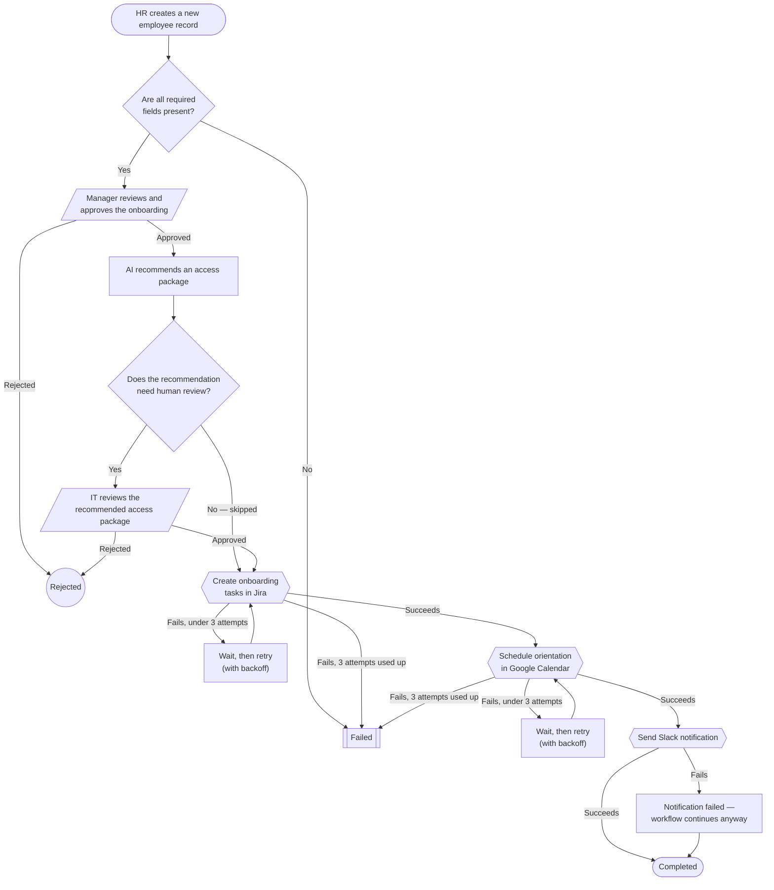
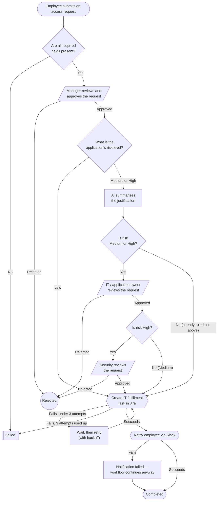

# Workflow Flow Diagrams

Generated directly from `workflows/employee_onboarding.json`, `workflows/software_access_request.json`, and the execution engine (`backend/app/services/workflows/service.py`) — not from a prose description, so these are guaranteed to match what the code actually does. Supersedes any diagram generated from `flow-diagram-prompt.md` alone; verify against these if the two ever disagree.

Box text is plain English for readability — see the "Step key reference" table under each diagram to map a box back to its `step_key` in the JSON definition.

## Workflow 1 — Employee Onboarding

**Step key reference:** Validate = `validate_employee` · Manager review = `manager_approval` · AI recommendation = `recommend_access` · IT review = `it_review_access` · Jira = `create_it_tasks` · Calendar = `schedule_orientation` · Slack = `notify_slack`

## Workflow 2 — Software Access Request

**Step key reference:** Validate = `validate_request` · Manager review = `manager_approval` · AI summary = `summarize_justification` · IT review = `it_approval` · Security review = `security_approval` · Jira = `create_fulfillment_task` · Slack = `notify_employee`

## Approval chain by risk tier (Workflow 2)

| Risk level | Approvals required |
|---|---|
| Low | Manager only |
| Medium | Manager + IT |
| High | Manager + IT + Security |

## Reading notes

- Diamonds are decisions the *engine* makes automatically (validation, retry checks, condition checks). Parallelogram boxes are the only points where the workflow pauses for an actual human decision.
- The "wait, then retry" boxes represent the instance moving to a `waiting_external` state — it genuinely stops running until the worker process (`app/workers/runner.py`) picks the retry back up on its next poll (every 3s).
- The two "Failed" boxes per diagram are the same end state reached by different causes (bad input vs. exhausted retries) — reused deliberately, not a diagram bug.
